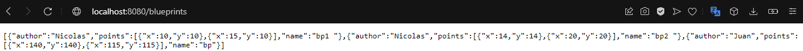
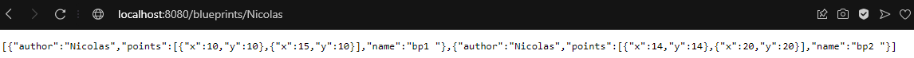
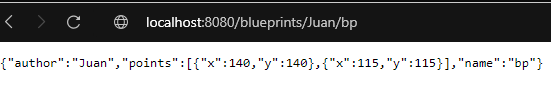
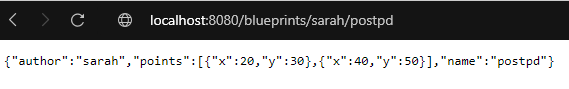

### Escuela Colombiana de Ingeniería

### Arquitecturas de Software


#### API REST para la gestión de planos.

En este ejercicio se va a construír el componente BlueprintsRESTAPI, el cual permita gestionar los planos arquitectónicos de una prestigiosa compañia de diseño. La idea de este API es ofrecer un medio estandarizado e 'independiente de la plataforma' para que las herramientas que se desarrollen a futuro para la compañía puedan gestionar los planos de forma centralizada.
El siguiente, es el diagrama de componentes que corresponde a las decisiones arquitectónicas planteadas al inicio del proyecto:


Donde se definió que:

* El componente BlueprintsRESTAPI debe resolver los servicios de su interfaz a través de un componente de servicios, el cual -a su vez- estará asociado con un componente que provea el esquema de persistencia. Es decir, se quiere un bajo acoplamiento entre el API, la implementación de los servicios, y el esquema de persistencia usado por los mismos.

Del anterior diagrama de componentes (de alto nivel), se desprendió el siguiente diseño detallado, cuando se decidió que el API estará implementado usando el esquema de inyección de dependencias de Spring (el cual requiere aplicar el principio de Inversión de Dependencias), la extensión SpringMVC para definir los servicios REST, y SpringBoot para la configurar la aplicación:


### Parte I

1. Integre al proyecto base suministrado los Beans desarrollados en el ejercicio anterior. Sólo copie las clases, NO los archivos de configuración. Rectifique que se tenga correctamente configurado el esquema de inyección de dependencias con las anotaciones @Service y @Autowired.

Añadimos las carpetas de ```filters``` ```model``` ```persistence``` y ```services``` con sus respectivas clases implementadas en el laboratorio pasado, la principal configuracion de inyección de dependencias con las anotaciones @Service y @Autowired las encontramos en la clase ```BlueprintsServices```

```java
@Service
public class BlueprintsServices {
   
    @Autowired
    @Qualifier("InMemoryBlueprintPersistence")
    BlueprintsPersistence bpp;

    @Autowired
    @Qualifier("RedundancyFilter")
    BlueprintsFilter bpf;


    public void addNewBlueprint(Blueprint bp) throws BlueprintPersistenceException {
        bpp.saveBlueprint(bp);
    }
    
    public Set<Blueprint> getAllBlueprints(){
        return bpp.getAllBlueprints();
    }
    
    /**
     * 
     * @param author blueprint's author
     * @param name blueprint's name
     * @return the blueprint of the given name created by the given author
     * @throws BlueprintNotFoundException if there is no such blueprint
     */
    public Blueprint getBlueprint(String author,String name) throws BlueprintNotFoundException{
        return bpp.getBlueprint(author,name);
    }
    
    /**
     * 
     * @param author blueprint's author
     * @return all the blueprints of the given author
     * @throws BlueprintNotFoundException if the given author doesn't exist
     */
    public Set<Blueprint> getBlueprintsByAuthor(String author) throws BlueprintNotFoundException{
        return bpp.getBlueprintsByAuthor(author);
    }

    public Blueprint filter(Blueprint bp){
        return bpf.filter(bp);
    }

}
```

2. Modifique el bean de persistecia 'InMemoryBlueprintPersistence' para que por defecto se inicialice con al menos otros tres planos, y con dos asociados a un mismo autor.

Creamos loa tres planos y dos los asociamos al autor ```Nicolas```

```java
@Service("InMemoryBlueprintPersistence")
public class InMemoryBlueprintPersistence implements BlueprintsPersistence{

    private final Map<Tuple<String,String>,Blueprint> blueprints=new HashMap<>();

    public InMemoryBlueprintPersistence() {
        //load stub data
        Point[] pts=new Point[]{new Point(140, 140),new Point(115, 115)};
        Point[] pts1=new Point[]{new Point(10, 10),new Point(15, 10)};
        Point[] pts2=new Point[]{new Point(14, 14),new Point(20, 20)};
        Blueprint bp=new Blueprint("Juan", "bp",pts);
        Blueprint bp1=new Blueprint("Nicolas", "bp1 ",pts);
        Blueprint bp2=new Blueprint("Nicolas", "bp2 ",pts);
        blueprints.put(new Tuple<>(bp.getAuthor(),bp.getName()), bp);
        blueprints.put(new Tuple<>(bp1.getAuthor(),bp1.getName()), bp1);
        blueprints.put(new Tuple<>(bp2.getAuthor(),bp2.getName()), bp2);
    }    
    
    @Override
    public void saveBlueprint(Blueprint bp) throws BlueprintPersistenceException {
        if (blueprints.containsKey(new Tuple<>(bp.getAuthor(),bp.getName()))){
            throw new BlueprintPersistenceException("The given blueprint already exists: "+bp);
        }
        else{
            blueprints.put(new Tuple<>(bp.getAuthor(),bp.getName()), bp);
        }        
    }

    @Override
    public Blueprint getBlueprint(String author, String bprintname) throws BlueprintNotFoundException {
        return blueprints.get(new Tuple<>(author, bprintname));
    }

    @Override
    public HashSet<Blueprint> getAllBlueprints(){
        return new HashSet<Blueprint>(blueprints.values());
    }

    @Override
    public Set<Blueprint> getBlueprintsByAuthor(String author) throws BlueprintNotFoundException{
        Set<Blueprint> resp = new HashSet<>();
        Set<Tuple<String,String>> llaves = blueprints.keySet();
        for (Tuple<String,String> i : llaves){
            if (i.getElem1().equals(author)){
                resp.add(blueprints.get(i));
            }
        }
        return resp;
    }
}
```

3. Configure su aplicación para que ofrezca el recurso "/blueprints", de manera que cuando se le haga una petición GET, retorne -en formato jSON- el conjunto de todos los planos. Para esto:

	* Modifique la clase BlueprintAPIController teniendo en cuenta el siguiente ejemplo de controlador REST hecho con SpringMVC/SpringBoot:

	```java
	@RestController
	@RequestMapping(value = "/url-raiz-recurso")
	public class XXController {
    
        
    @RequestMapping(method = RequestMethod.GET)
    public ResponseEntity<?> manejadorGetRecursoXX(){
        try {
            //obtener datos que se enviarán a través del API
            return new ResponseEntity<>(data,HttpStatus.ACCEPTED);
        } catch (XXException ex) {
            Logger.getLogger(XXController.class.getName()).log(Level.SEVERE, null, ex);
            return new ResponseEntity<>("Error bla bla bla",HttpStatus.NOT_FOUND);
        }        
	}

	```
	* Haga que en esta misma clase se inyecte el bean de tipo BlueprintServices (al cual, a su vez, se le inyectarán sus dependencias de persisntecia y de filtrado de puntos).

Modificamos la clase ```BlueprintAPIController``` agregando la inyección de ```BlueprintsServices``` para acceder a la data

```java
@RestController
@RequestMapping(value = "/blueprints")
public class BlueprintAPIController {
    @Autowired
    @Qualifier("BlueprintsServices")
    BlueprintsServices services;

    @RequestMapping(method = RequestMethod.GET)
    public ResponseEntity<?> manejadorBlueprints() {
        try {
            //obtener datos que se enviarán a través del API
            return new ResponseEntity<>(services.getAllBlueprints(), HttpStatus.ACCEPTED);
        } catch (Exception ex) {
            Logger.getLogger(BlueprintAPIController.class.getName()).log(Level.SEVERE, null, ex);
            return new ResponseEntity<>("Error bla bla bla", HttpStatus.NOT_FOUND);
        }
    }
}
```

4. Verifique el funcionamiento de a aplicación lanzando la aplicación con maven:

    ```bash
    $ mvn compile
    $ mvn spring-boot:run
	
    ```
    Y luego enviando una petición GET a: http://localhost:8080/blueprints. Rectifique que, como respuesta, se obtenga un objeto jSON con una lista que contenga el detalle de los planos suministados por defecto, y que se haya aplicado el filtrado de puntos correspondiente.

    ```java
   @Autowired
    @Qualifier("BlueprintsServices")
    BlueprintsServices services;
    @RequestMapping(method = RequestMethod.GET)
    public ResponseEntity<?> manejadorBlueprints() {
        try {
            //obtener datos que se enviarán a través del API
            return new ResponseEntity<>(services.getAllBlueprints(), HttpStatus.ACCEPTED);
        } catch (Exception ex) {
            Logger.getLogger(BlueprintAPIController.class.getName()).log(Level.SEVERE, null, ex);
            return new ResponseEntity<>("Error bla bla bla", HttpStatus.NOT_FOUND);
        }
    }
    ```
   

5. Modifique el controlador para que ahora, acepte peticiones GET al recurso /blueprints/{author}, el cual retorne usando una representación jSON todos los planos realizados por el autor cuyo nombre sea {author}. Si no existe dicho autor, se debe responder con el código de error HTTP 404. Para esto, revise en [la documentación de Spring](http://docs.spring.io/spring/docs/current/spring-framework-reference/html/mvc.html), sección 22.3.2, el uso de @PathVariable. De nuevo, verifique que al hacer una petición GET -por ejemplo- a recurso http://localhost:8080/blueprints/juan, se obtenga en formato jSON el conjunto de planos asociados al autor 'juan' (ajuste esto a los nombres de autor usados en el punto 2).

    ```java
    @RequestMapping(value = "/{author}", method = RequestMethod.GET)
    public ResponseEntity<?> manejadorBlueprintsByAuthor(@PathVariable("author") String author) {
        try {
            //obtener datos que se enviarán a través del API
            return new ResponseEntity<>(services.getBlueprintsByAuthor(author), HttpStatus.ACCEPTED);
        } catch (Exception ex) {
            Logger.getLogger(BlueprintAPIController.class.getName()).log(Level.SEVERE, null, ex);
            return new ResponseEntity<>("Error bla bla bla", HttpStatus.NOT_FOUND);
        }
    }	
    ```

    

6. Modifique el controlador para que ahora, acepte peticiones GET al recurso /blueprints/{author}/{bpname}, el cual retorne usando una representación jSON sólo UN plano, en este caso el realizado por {author} y cuyo nombre sea {bpname}. De nuevo, si no existe dicho autor, se debe responder con el código de error HTTP 404. 

    ```java
   @RequestMapping(value = "/{author}/{bpname}", method = RequestMethod.GET)
    public ResponseEntity<?> manejadorBlueprintsGetBp(@PathVariable("author") String author,@PathVariable("bpname") String bpname) {
        try {
            //obtener datos que se enviarán a través del API
            return new ResponseEntity<>(services.getBlueprint(author,bpname), HttpStatus.ACCEPTED);
        } catch (Exception ex) {
            Logger.getLogger(BlueprintAPIController.class.getName()).log(Level.SEVERE, null, ex);
            return new ResponseEntity<>("Error bla bla bla", HttpStatus.NOT_FOUND);
        }
    }
	```
   
	
	
### Parte II

1.  Agregue el manejo de peticiones POST (creación de nuevos planos), de manera que un cliente http pueda registrar una nueva orden haciendo una petición POST al recurso ‘planos’, y enviando como contenido de la petición todo el detalle de dicho recurso a través de un documento jSON. Para esto, tenga en cuenta el siguiente ejemplo, que considera -por consistencia con el protocolo HTTP- el manejo de códigos de estados HTTP (en caso de éxito o error):

	``` java
	@RequestMapping(method = RequestMethod.POST)	
	public ResponseEntity<?> manejadorPostRecursoXX(@RequestBody TipoXX o){
        try {
            //registrar dato
            return new ResponseEntity<>(HttpStatus.CREATED);
        } catch (XXException ex) {
            Logger.getLogger(XXController.class.getName()).log(Level.SEVERE, null, ex);
            return new ResponseEntity<>("Error bla bla bla",HttpStatus.FORBIDDEN);            
        }        
 	
	}
 	```
 	Agremos nuestra implementacion usando el metodo ````addNewBlueprint````
	```java
	@RequestMapping(value="/crear-bp",method = RequestMethod.POST)
    @ResponseBody
    public ResponseEntity<?> manejadorPostBlueprint(@RequestBody Blueprint bp){
        try {
            services.addNewBlueprint(bp);
            return new ResponseEntity<>(HttpStatus.CREATED);
        } catch (Exception ex) {
            Logger.getLogger(BlueprintAPIController.class.getName()).log(Level.SEVERE, null, ex);
            return new ResponseEntity<>("Error bla bla bla",HttpStatus.FORBIDDEN);
        }
    }
	```


2.  Para probar que el recurso ‘planos’ acepta e interpreta
    correctamente las peticiones POST, use el comando curl de Unix. Este
    comando tiene como parámetro el tipo de contenido manejado (en este
    caso jSON), y el ‘cuerpo del mensaje’ que irá con la petición, lo
    cual en este caso debe ser un documento jSON equivalente a la clase
    Cliente (donde en lugar de {ObjetoJSON}, se usará un objeto jSON correspondiente a una nueva orden:

	```	
	$ curl -i -X POST -HContent-Type:application/json -HAccept:application/json http://URL_del_recurso_ordenes -d '{ObjetoJSON}'
	```

	Con lo anterior, registre un nuevo plano (para 'diseñar' un objeto jSON, puede usar [esta herramienta](http://www.jsoneditoronline.org/)):

	Nota: puede basarse en el formato jSON mostrado en el navegador al consultar una orden con el método GET.

	
	curl -i -X POST -HContent-Type:application/json -HAccept:application/json http://localhost:8080/blueprints/crear-bp -d "{"""author""":"""sarah""","""points""":[{"""x""":20,"""y""":30},{"""x""":40,"""y""":50}],"""name""":"""postpd"""}"

3. Teniendo en cuenta el autor y numbre del plano registrado, verifique que el mismo se pueda obtener mediante una petición GET al recurso '/blueprints/{author}/{bpname}' correspondiente.

	

4. Agregue soporte al verbo PUT para los recursos de la forma '/blueprints/{author}/{bpname}', de manera que sea posible actualizar un plano determinado.


### Parte III

El componente BlueprintsRESTAPI funcionará en un entorno concurrente. Es decir, atederá múltiples peticiones simultáneamente (con el stack de aplicaciones usado, dichas peticiones se atenderán por defecto a través múltiples de hilos). Dado lo anterior, debe hacer una revisión de su API (una vez funcione), e identificar:

* Qué condiciones de carrera se podrían presentar?
* Cuales son las respectivas regiones críticas?

Ajuste el código para suprimir las condiciones de carrera. Tengan en cuenta que simplemente sincronizar el acceso a las operaciones de persistencia/consulta DEGRADARÁ SIGNIFICATIVAMENTE el desempeño de API, por lo cual se deben buscar estrategias alternativas.

Escriba su análisis y la solución aplicada en el archivo ANALISIS_CONCURRENCIA.txt

#### Criterios de evaluación

1. Diseño.
	* Al controlador REST implementado se le inyectan los servicios implementados en el laboratorio anterior.
	* Todos los recursos asociados a '/blueprint' están en un mismo Bean.
	* Los métodos que atienden las peticiones a recursos REST retornan un código HTTP 202 si se procesaron adecuadamente, y el respectivo código de error HTTP si el recurso solicitado NO existe, o si se generó una excepción en el proceso (dicha excepción NO DEBE SER de tipo 'Exception', sino una concreta)	
2. Funcionalidad.
	* El API REST ofrece los recursos, y soporta sus respectivos verbos, de acuerdo con lo indicado en el enunciado.
3. Análisis de concurrencia.
	* En el código, y en las respuestas del archivo de texto, se tuvo en cuenta:
		* La colección usada en InMemoryBlueprintPersistence no es Thread-safe (se debió cambiar a una con esta condición).
		* El método que agrega un nuevo plano está sujeta a una condición de carrera, pues la consulta y posterior agregación (condicionada a la anterior) no se realizan de forma atómica. Si como solución usa un bloque sincronizado, se evalúa como R. Si como solución se usaron los métodos de agregación condicional atómicos (por ejemplo putIfAbsent()) de la colección 'Thread-Safe' usada, se evalúa como B.
